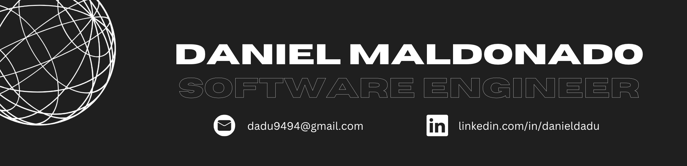

<h2 align="center">Hey! 👋</h2>
<h3 align="center">I'm a Full-stack Software Engineer who loves to code and build impactful projects</h3>

- 🌱 I'm currently learning **Go**

- 🚀 I'm developing an app (web and mobile) for **Personal Expense Management** enhanced with **AI**

- 💙 Right now, I'm coding mostly in **C++ and JavaScript**

- 📫 Reach out to me at **dadu9494@gmail.com** or through my **[LinkedIn profile](https://linkedin.com/in/danieldadu)**

- The languages and tools I have worked the most on...

 

 
 

